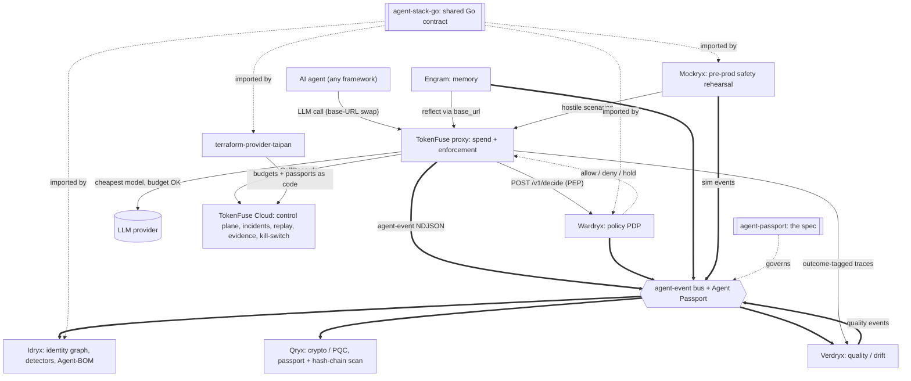

# wardryx: Policy Decision Point for agent actions

**Wardryx protects the operator by governing its own agents' actions. It blocks
or holds; it never acts.** Wardryx is a defensive, self-protection component of
the TAIPANBOX agent-governance stack: given a proposed action from an
operator's own AI agent (a tool call, a spend, a delegated step), it decides
`allow`, `deny`, or `hold` and returns that decision to whatever is enforcing
it. Wardryx never calls a tool, never reaches a network destination on an
agent's behalf, and never performs an action of any kind. It is a decision
plane, not an actor.

[](LICENSE)

[](#decision-engine)

---

## Where this fits in the stack

Wardryx is the **policy plane**: given a proposed action from one of the operator's own agents, it decides `allow`, `deny`, or `hold`. TokenFuse (the spend plane) calls it per request as the enforcement point (PEP); Wardryx is the decision point (PDP).



- **Consumes**: `/v1/decide` calls from TokenFuse (the PEP), Agent Passports, and policies. Tool names, step count, referenced domains, and estimated cost arrive per request.
- **Produces**: `allow` / `deny` / `hold` decisions (each carrying a `cacheable` flag), short-lived signed approval tokens, and `source: wardryx` events on the shared bus.
- **Talks to**: **TokenFuse** (per-request policy), and **Idryx** plus **Cloud** downstream via the agent-event bus. Imports **agent-stack-go** for the shared contract. Policies are configurable as code via **terraform-provider-taipan** (planned).

The full stack is TokenFuse (spend), Wardryx (policy), Engram (memory), Idryx (access), Qryx (crypto), Verdryx (quality), Mockryx (pre-prod), on the shared Agent Passport + agent-event contract (agent-stack-go / agent-passport), configured via terraform-provider-taipan.

## Table of contents

- [Why](#why)
- [What it does](#what-it-does)
- [The /v1/decide contract](#the-v1decide-contract)
- [Stateless human-in-the-loop](#stateless-human-in-the-loop)
- [Architecture](#architecture)
- [Install](#install)
- [Quick start](#quick-start)
- [Configuration](#configuration)
- [Testing](#testing)
- [Security](#security)
- [License](#license)

---

## Why

An operator running AI agents needs a place to say, once and declaratively,
what its own agents may do: which tools are off-limits, which agents must
carry a live attestation before they can act, and which spend levels need a
human in the loop before the agent proceeds. Wardryx is that place: a Policy
Decision Point (PDP) that an enforcement point (an MCP gateway, a tool-calling
runtime, a proxy) calls before letting an agent's action through.

Wardryx sits next to, and imports the same shared contract as, the rest of the
TAIPANBOX stack ([Idryx](https://github.com/TAIPANBOX/idryx)'s identity graph,
[agent-stack-go](https://github.com/TAIPANBOX/agent-stack-go)'s Agent Passport
and agent-event types). It is entirely deterministic: no LLM appears anywhere
in the decision path, matching Idryx's own rule for its detectors. Given the
same loaded policy set and the same request, `Decide` always returns the same
answer.

---

## What it does

1. **Policy model** (`internal/policy`): declarative policies loaded from a
   YAML or JSON file or directory. Each policy targets an `agent://` glob and
   can set `deny_tool`, `allow_domains`, `require_human_above_usd`,
   `max_steps`, and `deny_if_unattested`. Policies compile into an in-memory
   matcher with a stable `PolicyVersion` (a short sha256 hex digest of the
   normalized rule set), so every decision can be tied back to the exact rule
   generation that produced it.
2. **Decision engine** (`internal/pdp`): `Engine.Decide` matches policies
   for the requesting agent and applies, in order: an invalid delegation
   chain denies outright; a requested tool in `deny_tool` denies; a matched
   `deny_if_unattested` policy with no live attestation denies; a run's
   accumulated step count at or over a matched `max_steps` denies; a
   declared domain absent from a matched `allow_domains` denies; an
   estimated cost over a matched `require_human_above_usd` threshold holds,
   unless a valid `approval_token` is presented (then it allows) or an
   *invalid* token is presented (then it denies, rather than being quietly
   treated the same as no token at all); otherwise it allows. A deny from
   any rule wins outright and short-circuits the rest.
   `allow_domains` is enforced over the domains the caller declares in the
   request (its tools' or MCP servers' declared destinations), not over
   what a tool actually reaches at runtime -- an empty declared-domains list
   is a no-op, never a denial, and full runtime tool-egress enforcement is
   the job of whatever proxies the tool call (an MCP broker), not Wardryx.
   `max_steps` is enforced over the run's accumulated step count, supplied
   by the enforcement point on every `/v1/decide` call.
3. **Stateless human-in-the-loop** (`internal/approval`): a hold creates a
   pending row (`internal/store`) and returns immediately; nothing blocks
   waiting for a human. An admin decision later mints a short-lived
   HMAC-SHA256-signed `approval_token`, bound to the exact
   `(agent_id, run_id, tool set)` that was held, which a subsequent
   `/v1/decide` call redeems statelessly (no database lookup on the token
   itself).
4. **HTTP API** (`internal/api`): `POST /v1/decide`,
   `POST /v1/approvals/{id}/decide` (admin only), `GET /v1/approvals`
   (org-scoped), `GET /healthz`. Bearer-key auth mirrors the Cloud plane's
   `key:org[:role]` convention (TokenFuse `crates/cloud/src/keys.rs`),
   reimplemented in Go for the same wire format.
5. **Storage** (`internal/store`): Postgres via `pgx/v5` with an embedded,
   idempotent `schema.sql`, or an in-memory store when no DSN is configured.
   Both implementations satisfy the same `Store` interface.
6. **Events** (`source: wardryx`): optional NDJSON `agent-event` output
   (`WARDRYX_EVENTS_PATH`) via `agent-stack-go/event`: `policy_allow`,
   `policy_deny`, `approval_requested`, `approval_granted`,
   `approval_denied`, `approval_timeout`.
7. **CLI** (`cmd/wardryx`): `serve`, `check` (an offline dry-run over a
   directory of Agent Passports), `approvals` (list from Postgres),
   `version`.

---

## The /v1/decide contract

Request:

```json
POST /v1/decide
Authorization: Bearer <key>
Content-Type: application/json

{
  "agent_id": "agent://acme.example/finance/bot1",
  "run_id": "run-42",
  "on_behalf_of": ["user://acme.example/alice"],
  "tool_names": ["send_wire_transfer"],
  "domains": ["payments.acme.example"],
  "steps": 3,
  "model": "claude-sonnet-5",
  "est_cost_usd": 1200.00,
  "attestation_method": "spiffe-svid",
  "approval_token": ""
}
```

`domains` and `steps` are both optional and both default to "impose no
restriction" when omitted: an empty/absent `domains` means the caller
declared no network destinations to check against `allow_domains`, and a
zero/absent `steps` never trips `max_steps` on its own (a matched policy's
`max_steps` still has to be positive for the rule to fire at all).

Response (a hold, in this example, because `send_wire_transfer`'s cost is
above the matched policy's `require_human_above_usd`):

```json
{
  "decision": "hold",
  "policy_version": "3f9a2b7c1d4e",
  "reason": "estimated cost $1200.00 exceeds policy \"finance-guardrail\" threshold $500.00; human approval required",
  "approval_id": "ap_8f3e1c2a...",
  "approval_token_required": true,
  "cacheable": false
}
```

`decision` is always one of `allow`, `deny`, or `hold`. `approval_id` is only
set on a hold. `approval_token_required` is true whenever the estimated cost
crossed a threshold at all, whether or not a token ultimately satisfied it.
A denied `max_steps` or `allow_domains` check reports its own `reason`
(e.g. `"policy \"finance-guardrail\" step budget exhausted: 5 >= max_steps
5"` or `"domain \"evil.example.com\" is not allowed by policy
\"finance-guardrail\" (target agent://acme.example/finance/*)"`) with
`decision: "deny"` and `approval_token_required: false`, since a deny from
an earlier rule short-circuits before the cost threshold is ever reached.

`cacheable` tells the caller whether this decision may be stored and later
served again, by whatever cache the caller keeps in front of `/v1/decide`,
for another request against the same `agent_id` and tool set, without
calling `/v1/decide` again. It is `true` only when no policy matched by
`agent_id` sets `max_steps`, `allow_domains`, or `require_human_above_usd`
-- the three fields Decide checks against this request's own `steps`,
`domains`, and `est_cost_usd`, any of which can differ on the very next call
even for the same agent and the same tools -- or when no policy matched at
all. It is `false` whenever a matched policy sets any of those three,
regardless of which rule actually produced this decision: Wardryx is the
source of truth for whether a decision generalizes beyond the one request
that produced it, not the caller. `cacheable` is independent of `decision`
itself -- a cacheable decision can be `allow`, `deny`, or `hold` alike --
though a caller's own cache should still never store a `hold` regardless of
`cacheable`, since a replayed one would hand out a stale `approval_id` for
what looks like a fresh hold. TokenFuse's gateway
(`crates/gateway/src/wardryx.rs`) is the reference implementation: its
decision cache is keyed only on `(agent_id, tool-set hash)`, coarser than
the full request, and now gates every store on `cacheable` so a
request-specific decision is never served stale within the cache's TTL.

---

## Stateless human-in-the-loop

```
1. agent    -> POST /v1/decide                                  -> wardryx
2. wardryx  -> {"decision": "hold", "approval_id": "..."}       -> agent
                (pending row written to store; nothing blocks)

3. admin    -> POST /v1/approvals/{id}/decide {"decision":"grant", ...} -> wardryx
                (wardryx mints an approval_token bound to agent_id/run_id/tool set)
4. wardryx  -> {"approval_token": "..."}                        -> admin

5. agent    -> POST /v1/decide (same action, approval_token set) -> wardryx
6. wardryx  -> {"decision": "allow"}                             -> agent
```

No connection is ever parked waiting for the human: the agent (or its
orchestrator) polls `GET /v1/approvals` or is notified out of band, and the
eventual grant is proven by the signed token, not by wardryx remembering an
open request. This mirrors the stateless kill-switch pattern already used
elsewhere in the TAIPANBOX stack (TokenFuse).

The token is a compact `base64url(claims) + "." + hex(HMAC-SHA256)` string,
where `claims` is `{agent_id, run_id, tools (sorted), exp}`. Verification
recomputes the HMAC over the still-encoded payload before decoding anything,
checks the expiry (default 10 minutes from grant), and checks that the
agent/run/tool-set presented at `/v1/decide` exactly match what was granted.
`WARDRYX_APPROVAL_SECRET` is fail-closed: unset, minting and verifying both
refuse rather than accept, since there is no such thing as an unsigned or
always-valid token.

---

## Architecture

```
cmd/wardryx/main.go     CLI: serve | check | approvals | version
internal/policy         policy model, YAML/JSON loader, glob matcher, PolicyVersion
internal/pdp            Engine.Decide: the pure decision algorithm
internal/approval       approval_token minting/verification (HMAC-SHA256) + hold/decide orchestration
internal/store          Store interface; Postgres (pgx/v5, embedded schema.sql) + in-memory
internal/api            net/http API: bearer auth, /v1/decide, /v1/approvals, /healthz
internal/passports      directory loader for the offline `check` command (agent-stack-go/passport)
internal/config         WARDRYX_* environment variables, read once at startup
```

Design principles, held as hard rules:

- **Deterministic decisions.** `pdp.Decide` is a pure function of the loaded
  policy set and the request. No LLM anywhere in the decision path.
- **Never an actor.** Wardryx returns a decision; it never calls a tool,
  never reaches a network destination, and never mutates anything on an
  agent's behalf.
- **Stateless approvals.** A hold never parks a connection or a goroutine.
  The proof of a later grant is a signed, self-contained token, not a stored
  session.
- **Fail closed on missing security config.** No `WARDRYX_APPROVAL_SECRET`
  means no token can ever mint or verify: never an implicit "allow."

---

## Install

Build from source (Go 1.26+):

```sh
make build   # -> ./bin/wardryx
```

---

## Quick start

```sh
make build

# serve: HTTP policy decision API
./bin/wardryx serve                                    # :8090, in-memory store, no policy (allows everything)
./bin/wardryx serve -addr :9000 -policy ./policies -db "$DSN" -events ./events.ndjson

# check: offline dry-run over a directory of Agent Passports
./bin/wardryx check ./passports ./policies/finance.yaml
./bin/wardryx check -format json ./passports ./policies/finance.yaml

# approvals: list pending/decided approvals from Postgres
./bin/wardryx approvals -db "$DSN"

./bin/wardryx version
```

Run against the bundled fixtures:

```sh
make check   # offline dry-run over cmd/wardryx/testdata
make serve   # then curl -H "Authorization: Bearer devkey" localhost:8090/healthz
```

Example policy file (`policies/finance.yaml`):

```yaml
name: finance-guardrail
target: "agent://acme.example/finance/*"
deny_tool:
  - send_wire_transfer
  - delete_account
allow_domains:
  - payments.acme.example
require_human_above_usd: 500
max_steps: 40
deny_if_unattested: true
```

---

## Configuration

Every `WARDRYX_*` variable is read once at process startup
(`internal/config`), never per-request. Each `serve` flag falls back to its
environment variable when the flag itself is left unset.

| Variable | Flag | Meaning |
| --- | --- | --- |
| `WARDRYX_ADDR` | `-addr` | Listen address (default `:8090`) |
| `WARDRYX_KEYS` | (none) | `key:org[:role],...` bearer keys; empty gives a single dev key `devkey` -> `default`/`admin` |
| `WARDRYX_DB` | `-db` | Postgres DSN; empty uses the in-memory store |
| `WARDRYX_POLICY` | `-policy` | Policy file or directory (YAML/JSON); empty allows every request |
| `WARDRYX_EVENTS_PATH` | `-events` | NDJSON agent-event output path; empty disables events |
| `WARDRYX_APPROVAL_SECRET` | (none) | HMAC key for approval tokens; unset fails closed on any mint/verify |
| `WARDRYX_OTLP_ENDPOINT` | (none) | Reserved for a future OTLP exporter; read into `Config` but not otherwise consulted by this build |

The `[:role]` segment of a `WARDRYX_KEYS` entry is one of `admin` (every endpoint, including `POST /v1/approvals/{id}/decide`) or `viewer` (every other authenticated endpoint), and defaults to `admin` when the segment is omitted.

---

## Testing

```sh
make test        # go test ./...
make test-race   # go test -race ./...
make lint        # go vet + staticcheck + gofmt check
make test-integration   # Postgres-backed internal/store tests; needs DATABASE_URL
```

The decision engine's table tests (`internal/pdp/pdp_test.go`) cover: allow;
deny (denied tool); deny (unattested); hold (over threshold); allow with a
valid approval token; and deny with an expired or wrong-binding token, plus
`PolicyVersion` stability and the offline `check` path.

---

## Security

Wardryx is itself a security-relevant component, so a few of its own
defaults are worth stating plainly:

- With no `-policy`/`WARDRYX_POLICY` configured, `serve` starts anyway and
  allows every request (an explicit, logged choice, not a silent one).
- With no `-db`/`WARDRYX_DB` configured, approval state lives only in
  process memory and is lost on restart.
- A malformed policy file is a **hard error**: `serve` and `check` refuse to
  start rather than silently loading a smaller rule set than intended.
- `WARDRYX_APPROVAL_SECRET` unset fails every mint/verify closed; there is no
  fallback to an unsigned or always-valid token.

## License

[Apache-2.0](LICENSE).

<div align="center">
<sub>wardryx: policy + action-authorization plane for the TAIPANBOX agent-governance stack</sub>
</div>
