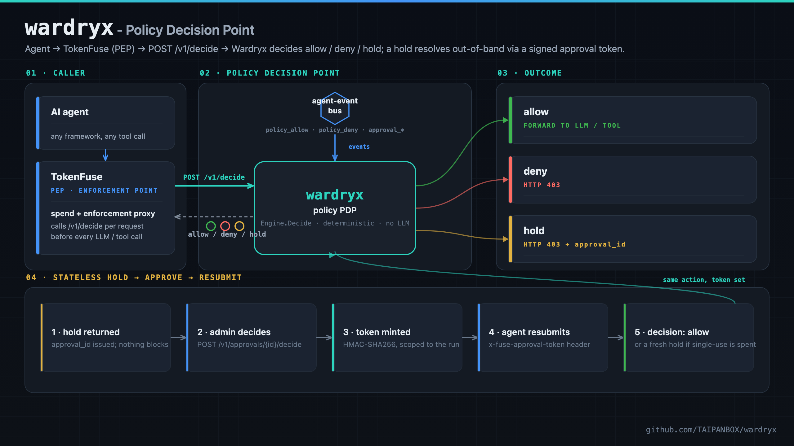
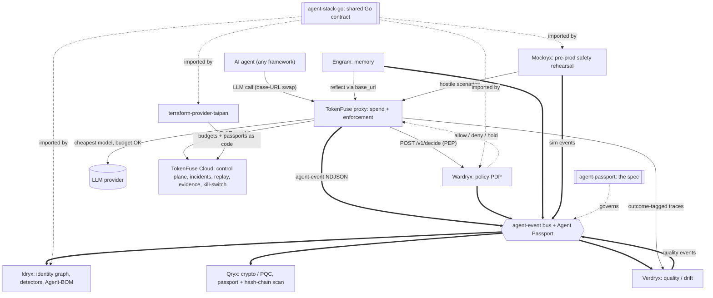
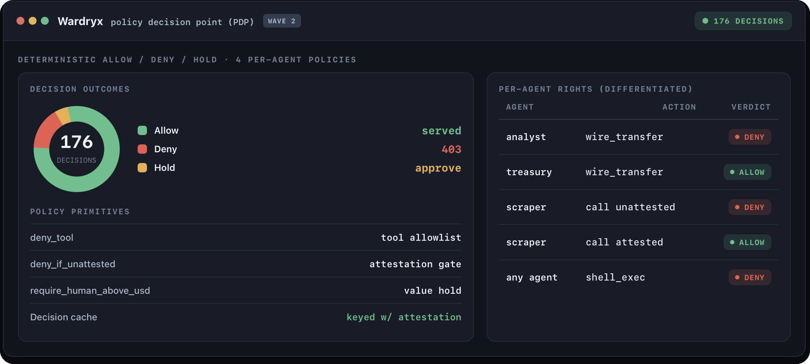
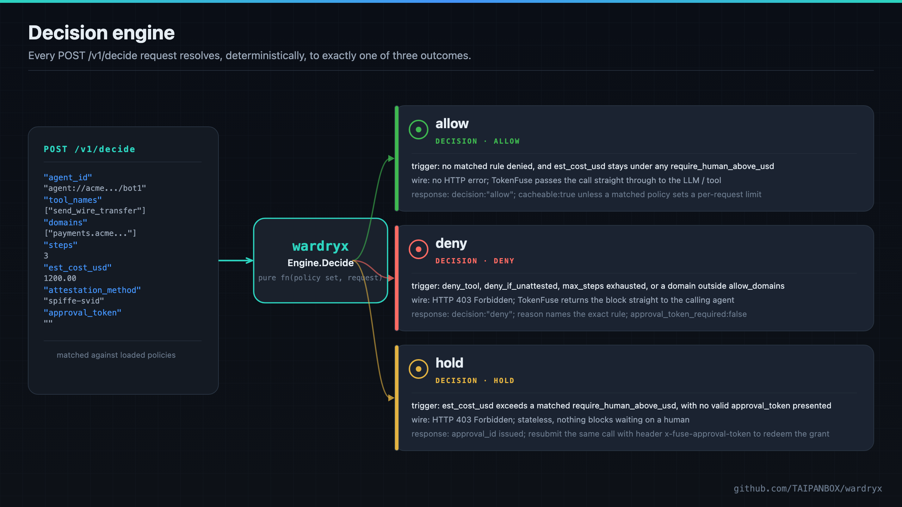
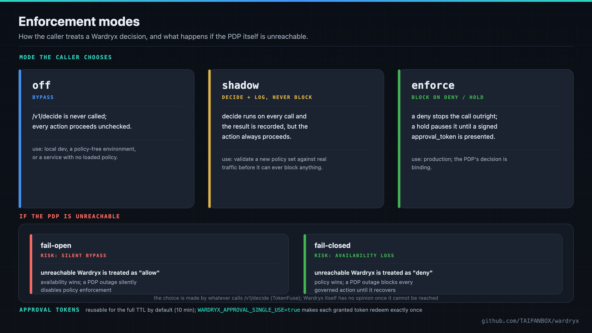

<div align="center">

# wardryx - Agent Policy Decision Point

**Decide allow, deny, or hold for every action your own agents attempt, before an enforcement point lets it through.**

[](https://github.com/TAIPANBOX/wardryx/actions/workflows/ci.yml)




</div>

Wardryx protects the operator by governing its own agents' actions: it blocks or holds, it never acts. Given a proposed action from one of the operator's own AI agents (a tool call, a spend, a delegated step), it decides `allow`, `deny`, or `hold` and returns that decision to whatever enforces it, an MCP gateway, a tool-calling runtime, or TokenFuse's proxy. Every decision is a deterministic function of the loaded policy set and the request: no LLM anywhere in the decision path, so the same policy and the same request always return the same answer.

---

## Where this fits in the stack

Wardryx is the **policy plane**: given a proposed action from one of the operator's own agents, it decides `allow`, `deny`, or `hold`. TokenFuse (the spend plane) calls it per request as the enforcement point (PEP); Wardryx is the decision point (PDP).



- **Consumes**: `/v1/decide` calls from TokenFuse (the PEP), Agent Passports, and policies. Tool names, step count, referenced domains, and estimated cost arrive per request.
- **Produces**: `allow` / `deny` / `hold` decisions (each carrying a `cacheable` flag), short-lived signed approval tokens, and `source: wardryx` events on the shared bus.
- **Talks to**: **TokenFuse** (per-request policy), and **Idryx** plus **Cloud** downstream via the agent-event bus. Imports **agent-stack-go** for the shared contract. Policies are configurable as code via **terraform-provider-taipan**.

The full stack is TokenFuse (spend), Wardryx (policy), Engram (memory), Idryx (access), Qryx (crypto), Verdryx (quality), Mockryx (pre-prod), on the shared Agent Passport + agent-event contract (agent-stack-go / agent-passport), configured via terraform-provider-taipan.

Run the whole open stack locally with one command via [**stack-up**](https://github.com/TAIPANBOX/stack-up); the stack's home on the web is [**it-rat.com**](https://it-rat.com).

## Live infrastructure validation

Before any public launch, Wardryx was run as a live policy decision point under real concurrent load:
176 real decisions with differentiated per-agent rights, correctly filtered under a 34-request concurrent
burst - including two real enforcement gaps that only concurrent traffic exposed, both found and fixed.



Full write-up and both bugs live testing found (and fixed): [`VALIDATION.md`](VALIDATION.md).

---

## Why

An operator running AI agents needs a place to say, once and declaratively, what its own agents may do: which tools are off-limits, which agents must carry a live attestation before they can act, and which spend levels need a human in the loop before the agent proceeds. Wardryx is that place: a Policy Decision Point (PDP) that an enforcement point (an MCP gateway, a tool-calling runtime, a proxy) calls before letting an agent's action through.

Wardryx sits next to, and imports the same shared contract as, the rest of the TAIPANBOX stack ([Idryx](https://github.com/TAIPANBOX/idryx)'s identity graph, [agent-stack-go](https://github.com/TAIPANBOX/agent-stack-go)'s Agent Passport and agent-event types). It is entirely deterministic: no LLM appears anywhere in the decision path, matching Idryx's own rule for its detectors. Given the same loaded policy set and the same request, `Decide` always returns the same answer.

---

## Decision engine

<div align="center">

</div>

Policies (`internal/policy`) load from a YAML or JSON file or directory. Each policy targets an `agent://` glob and can set `deny_tool`, `allow_domains`, `require_human_above_usd`, `deny_above_usd`, `max_steps`, and `deny_if_unattested`; they compile into an in-memory matcher with a stable `PolicyVersion` (a short sha256 hex digest of the normalized rule set), so every decision ties back to the exact rule generation that produced it.

`Engine.Decide` (`internal/pdp`) matches policies for the requesting agent and applies, in order: an invalid delegation chain denies outright; a requested tool in `deny_tool` denies; a matched `deny_if_unattested` policy with no live attestation denies; a run's accumulated step count at or over a matched `max_steps` denies; a declared domain absent from a matched `allow_domains` denies; an estimated cost over a matched `deny_above_usd` hard ceiling denies outright (no approval can authorize it, and this precedes the hold below); an estimated cost over a matched `require_human_above_usd` threshold holds, unless a valid `approval_token` is presented (then it allows) or an *invalid* token is presented (then it denies, rather than being quietly treated the same as no token at all); otherwise it allows. A deny from any rule wins outright and short-circuits the rest.

`allow_domains` is enforced over the domains the caller declares in the request (its tools' or MCP servers' declared destinations), not over what a tool actually reaches at runtime: an empty declared-domains list is a no-op, never a denial, and full runtime tool-egress enforcement is the job of whatever proxies the tool call (an MCP broker), not Wardryx. `max_steps` is enforced over the run's accumulated step count, supplied by the enforcement point on every `/v1/decide` call.

| Decision | Trigger | Wire behavior | Response |
|---|---|---|---|
| `allow` | no matched rule denied, `est_cost_usd` stays under any matched `require_human_above_usd` and `deny_above_usd` | no HTTP error; the enforcement point forwards the call | `decision:"allow"`; `cacheable:true` unless a matched policy sets `max_steps`, `allow_domains`, `require_human_above_usd`, or `deny_above_usd` |
| `deny` | `deny_tool` matched, `deny_if_unattested` with no live attestation, `max_steps` exhausted, a domain outside `allow_domains`, or `est_cost_usd` over a matched `deny_above_usd` hard ceiling | HTTP 403 Forbidden from the enforcement point back to the agent | `decision:"deny"`; `reason` names the exact rule; `approval_token_required:false` |
| `hold` | `est_cost_usd` exceeds a matched `require_human_above_usd`, with no valid `approval_token` presented | HTTP 403 Forbidden; stateless, nothing blocks waiting on a human | `approval_id` issued; resubmit the same call with header `x-fuse-approval-token` to redeem the grant |

### The /v1/decide contract

Request:

```json
POST /v1/decide
Authorization: Bearer <key>
Content-Type: application/json

{
  "agent_id": "agent://acme.example/finance/bot1",
  "run_id": "run-42",
  "on_behalf_of": ["user://acme.example/alice"],
  "tool_names": ["send_wire_transfer"],
  "domains": ["payments.acme.example"],
  "steps": 3,
  "model": "claude-sonnet-5",
  "est_cost_usd": 1200.00,
  "attestation_method": "spiffe-svid",
  "approval_token": ""
}
```

`domains` and `steps` are both optional and both default to "impose no restriction" when omitted: an empty/absent `domains` means the caller declared no network destinations to check against `allow_domains`, and a zero/absent `steps` never trips `max_steps` on its own (a matched policy's `max_steps` still has to be positive for the rule to fire at all).

Response (a hold, in this example, because `send_wire_transfer`'s cost is above the matched policy's `require_human_above_usd`):

```json
{
  "decision": "hold",
  "policy_version": "3f9a2b7c1d4e",
  "reason": "estimated cost $1200.00 exceeds policy \"finance-guardrail\" threshold $500.00; human approval required",
  "approval_id": "ap_8f3e1c2a...",
  "approval_token_required": true,
  "cacheable": false
}
```

`decision` is always one of `allow`, `deny`, or `hold`. `approval_id` is only set on a hold. `approval_token_required` is true whenever the estimated cost crossed a threshold at all, whether or not a token ultimately satisfied it. A denied `max_steps` or `allow_domains` check reports its own `reason` (e.g. `"policy \"finance-guardrail\" step budget exhausted: 5 >= max_steps 5"` or `"domain \"evil.example.com\" is not allowed by policy \"finance-guardrail\" (target agent://acme.example/finance/*)"`) with `decision: "deny"` and `approval_token_required: false`, since a deny from an earlier rule short-circuits before the cost threshold is ever reached.

`cacheable` tells the caller whether this decision may be stored and later served again, by whatever cache the caller keeps in front of `/v1/decide`, for another request against the same `agent_id` and tool set, without calling `/v1/decide` again. It is `true` only when no policy matched by `agent_id` sets `max_steps`, `allow_domains`, `require_human_above_usd`, or `deny_above_usd` (the four fields Decide checks against this request's own `steps`, `domains`, and `est_cost_usd`, any of which can differ on the very next call even for the same agent and the same tools), or when no policy matched at all. It is `false` whenever a matched policy sets any of those four, regardless of which rule actually produced this decision: Wardryx is the source of truth for whether a decision generalizes beyond the one request that produced it, not the caller. `cacheable` is independent of `decision` itself, a cacheable decision can be `allow`, `deny`, or `hold` alike, though a caller's own cache should still never store a `hold` regardless of `cacheable`, since a replayed one would hand out a stale `approval_id` for what looks like a fresh hold. TokenFuse's gateway (`crates/gateway/src/wardryx.rs`) is the reference implementation: its decision cache gates every store on `cacheable` and is keyed on `(agent_id, tool-set hash, attestation_method)`, coarser than the full request but no longer blind to attestation. That third field is load-bearing, not cosmetic: a `deny_if_unattested`-only decision is still `cacheable:true` under the rule above, since attestation is not one of the three fields that make a decision request-specific, so a cache keyed just on `(agent_id, tool-set hash)` could serve an attested agent's cached `allow` to a later, unattested request against the same agent and tool set within the TTL, silently defeating `deny_if_unattested`. TokenFuse hit exactly that gap in a concurrent multi-agent test on 2026-07-11 and closed it by folding `attestation_method` into the cache key (TokenFuse PR #110). The bug and its fix were both entirely on TokenFuse's side: Wardryx never caches anything itself, it only returns the decision and the `cacheable` hint that tells a caller's own cache what it may safely store.

---

## Stateless human-in-the-loop

```
1. agent    -> POST /v1/decide                                  -> wardryx
2. wardryx  -> {"decision": "hold", "approval_id": "..."}       -> agent
                (pending row written to store; nothing blocks)

3. admin    -> POST /v1/approvals/{id}/decide {"decision":"grant", ...} -> wardryx
                (wardryx mints an approval_token bound to agent_id/run_id/tool set)
4. wardryx  -> {"approval_token": "..."}                        -> admin

5. agent    -> POST /v1/decide (same action, approval_token set) -> wardryx
6. wardryx  -> {"decision": "allow"}                             -> agent
```

No connection is ever parked waiting for the human: the agent (or its orchestrator) polls `GET /v1/approvals` or is notified out of band, and the eventual grant is proven by the signed token, not by wardryx remembering an open request. This mirrors the stateless kill-switch pattern already used elsewhere in the TAIPANBOX stack (TokenFuse).

The token is a compact `base64url(claims) + "." + hex(HMAC-SHA256)` string, where `claims` is `{agent_id, run_id, tools (sorted), exp}`. Verification recomputes the HMAC over the still-encoded payload before decoding anything, checks the expiry (default 10 minutes from grant), and checks that the agent/run/tool-set presented at `/v1/decide` exactly match what was granted. `WARDRYX_APPROVAL_SECRET` is fail-closed: unset, minting and verifying both refuse rather than accept, since there is no such thing as an unsigned or always-valid token.

By default a granted token stays valid for every `/v1/decide` call that presents it within the TTL window, steps 5-6 above can repeat. Setting `WARDRYX_APPROVAL_SINGLE_USE=true` tightens this: the first `/v1/decide` call that redeems a token records the redemption in the store (an atomic check-and-set, `Store.TryRedeem`, keyed by a hash of the token itself so a later, separately-granted token for the same `agent_id`/`run_id`/tool set is never mistaken for the earlier one); a second presentation of that *same* token no longer allows, it falls back to a fresh `hold` (a new `approval_id`), exactly as if no token had been presented, so the action can be re-approved out of band rather than silently allowed again. This is off by default, so with `WARDRYX_APPROVAL_SINGLE_USE` unset the decide path is byte-for-byte unchanged from before single-use existed.

Single-use redemption tracking has the same durability split as approval holds themselves: with `-db`/`WARDRYX_DB` set, `TryRedeem` is a Postgres `INSERT .. ON CONFLICT DO NOTHING` (atomic across every wardryx instance sharing that database); with no `-db`, redemptions live in one process's memory only, so single-use is enforced per-process, not across multiple wardryx instances behind a load balancer. `serve` prints a startup warning to stderr when `WARDRYX_APPROVAL_SINGLE_USE=true` is combined with no `-db`, so this caveat is never silent.

---

## Policy-as-code

`-policy`/`WARDRYX_POLICY` (above) loads policy files once at startup and never hot-reloads them -- that stays exactly true. On top of it, four admin-only routes let an operator manage a second, additional layer of policies at runtime, without a restart:

```
GET    /v1/policies       list every store-managed policy
GET    /v1/policies/{id}  fetch one
PUT    /v1/policies/{id}  create or replace one (body: a policy.Policy document, e.g. the YAML example above as JSON)
DELETE /v1/policies/{id}  remove one
```

The file-loaded set is a **permanent floor**: every one of these routes recompiles `file-loaded policies + everything currently in the store` together (`internal/api.ComputePolicySet`) and swaps the result into `pdp.Engine` atomically (`Engine.SetPolicies`, an `atomic.Pointer[policy.Set]` under the hood) -- an API write can add, replace, or remove a *store-managed* rule, but it can never make a *file-loaded* one disappear, and the file-loaded policies aren't individually addressable through this API at all (they have no `id`). A `-db`/`WARDRYX_DB` Postgres store persists what's written here across a restart (a new `policies` table, additive migration); with no `-db`, an in-memory store still accepts writes for the life of the process, same "lost on restart" caveat every other in-memory piece of state already carries.

Every `PUT`/`DELETE` is validate-then-apply, never partial: the *whole* prospective combined set is compiled (`policy.Compile`) before anything is persisted or swapped, so a request that would produce an invalid policy (empty `target`, a negative threshold, a bad glob) is rejected with both the store and the live `Engine` left exactly as they were -- the same "malformed policy is a hard error" rule the file path already enforces, now also covering runtime writes. A successful write also emits a `policy_updated` agent-event (severity `high`, `source: "wardryx"`) if an event log is configured.

```sh
curl -X PUT localhost:8090/v1/policies/ops-guard \
  -H "Authorization: Bearer $ADMIN_KEY" -H "Content-Type: application/json" \
  -d '{"target": "agent://acme.example/ops/*", "deny_tool": ["shell_exec"]}'

curl localhost:8090/v1/policies -H "Authorization: Bearer $ADMIN_KEY"

curl -X DELETE localhost:8090/v1/policies/ops-guard -H "Authorization: Bearer $ADMIN_KEY"
```

---

## OTLP export

`WARDRYX_OTLP_ENDPOINT` (or `-otlp-endpoint`) turns on one exported span per `/v1/decide` outcome -- allow, deny, or hold -- posted to `<endpoint>/v1/traces`. `internal/otel` builds the OTLP/HTTP-JSON payload directly (no OpenTelemetry SDK dependency), mirroring TokenFuse's own exporter (`crates/gateway/src/otel.rs`): small, hand-rolled, and a fire-and-forget POST from a background goroutine, so a slow or unreachable collector never adds latency to `/v1/decide` and a delivery failure is dropped silently, never surfaced to the caller.

Every decision belonging to one `run_id` shares a trace id (derived from `run_id` alone, SHA-256-based), so a run's `hold` followed later by an `allow` once approved shows up as one trace with two spans in Grafana/Datadog/Honeycomb, not two unrelated traces. Each span carries `wardryx.agent_id`, `wardryx.run_id`, `wardryx.decision`, and, when present, `wardryx.reason`, `wardryx.policy_version`, and `wardryx.tool_names`. The trace id derivation is Wardryx-internal, not shared with TokenFuse's own (Rust's hasher has no portable Go equivalent), so spans from the two services for the same `run_id` correlate today via the shared `run_id` attribute, not automatic trace grouping across services.

Empty (the default): zero cost, no goroutines, no allocation beyond the config read at startup -- identical to the exporter never having been added.

---

## Enforcement modes (at the PEP)

<div align="center">

</div>

Wardryx itself never acts: it is the enforcement point, TokenFuse's proxy or any MCP gateway calling `/v1/decide`, that chooses how much weight to give a decision. The pattern this stack follows has three modes at that call site, plus an explicit choice for what happens when Wardryx can't be reached at all.

| Mode | Behavior | Typical use |
|---|---|---|
| `off` | `/v1/decide` is never called; every action proceeds unchecked | local dev, a policy-free environment, or a service with no loaded policy |
| `shadow` | `/v1/decide` runs on every call and the result is recorded, but the action always proceeds | validate a new policy set against real traffic before it can ever block anything |
| `enforce` | a `deny` stops the call outright; a `hold` pauses it until a signed `approval_token` is presented | production: the PDP's decision is binding |

| If the PDP is unreachable | Behavior | Risk |
|---|---|---|
| fail-open | the enforcement point treats an unreachable Wardryx as `allow` | availability wins; an outage silently disables policy |
| fail-closed | the enforcement point treats an unreachable Wardryx as `deny` | policy wins; an outage blocks every governed action until Wardryx recovers |

This mirrors Wardryx's own stated defaults for its *own* availability: with no `-policy`/`WARDRYX_POLICY` configured, `serve` starts anyway and allows every request rather than refusing to start, an explicit, logged choice, not a silent one (see [Security](#security)). Approval tokens follow the same "explicit over implicit" rule: reusable for the full TTL by default (10 minutes), or set `WARDRYX_APPROVAL_SINGLE_USE=true` so each granted token redeems exactly once before falling back to a fresh hold (see [Stateless human-in-the-loop](#stateless-human-in-the-loop)).

---

## Components

Beyond the decision engine and the approval flow above, Wardryx ships:

1. **HTTP API** (`internal/api`): `POST /v1/decide`, `POST /v1/approvals/{id}/decide` (admin only), `GET /v1/approvals` (org-scoped), the admin-only `/v1/policies` policy-as-code routes (see [Policy-as-code](#policy-as-code)), `GET /healthz`. Bearer-key auth mirrors the Cloud plane's `key:org[:role]` convention (TokenFuse `crates/cloud/src/keys.rs`), reimplemented in Go for the same wire format.
2. **Storage** (`internal/store`): Postgres via `pgx/v5` with an embedded, idempotent `schema.sql`, or an in-memory store when no DSN is configured. Both implementations satisfy the same `Store` interface.
3. **Events** (`source: wardryx`): optional NDJSON `agent-event` output (`WARDRYX_EVENTS_PATH`) via `agent-stack-go/event`: `policy_allow`, `policy_deny`, `approval_requested`, `approval_granted`, `approval_denied`, `approval_timeout`.
4. **OTLP export** (`internal/otel`): optional one-span-per-decision export to an OTLP/HTTP collector (`WARDRYX_OTLP_ENDPOINT`), see [OTLP export](#otlp-export).
5. **CLI** (`cmd/wardryx`): `serve`, `check` (an offline dry-run over a directory of Agent Passports), `approvals` (list from Postgres), `version`.

---

## Architecture

```
cmd/wardryx/main.go     CLI: serve | check | approvals | version
internal/policy         policy model, YAML/JSON loader, glob matcher, PolicyVersion
internal/pdp            Engine.Decide: the pure decision algorithm
internal/approval       approval_token minting/verification (HMAC-SHA256) + hold/decide orchestration
internal/store          Store interface; Postgres (pgx/v5, embedded schema.sql) + in-memory; approvals + policies
internal/api            net/http API: bearer auth, /v1/decide, /v1/approvals, /v1/policies, /healthz
internal/passports      directory loader for the offline `check` command (agent-stack-go/passport)
internal/otel           OTLP/HTTP-JSON span export, one per /v1/decide outcome
internal/config         WARDRYX_* environment variables, read once at startup
```

Design principles, held as hard rules:

- **Deterministic decisions.** `pdp.Decide` is a pure function of the loaded policy set and the request. No LLM anywhere in the decision path.
- **Never an actor.** Wardryx returns a decision; it never calls a tool, never reaches a network destination, and never mutates anything on an agent's behalf.
- **Stateless approvals.** A hold never parks a connection or a goroutine. The proof of a later grant is a signed, self-contained token, not a stored session.
- **Fail closed on missing security config.** No `WARDRYX_APPROVAL_SECRET` means no token can ever mint or verify: never an implicit "allow."
- **Policy writes never partially apply.** A `/v1/policies` write that would produce an invalid combined policy set is rejected before anything is persisted or the live `Engine` is touched -- the same "malformed policy is a hard error" rule the file path enforces, extended to runtime writes.

---

## Install

Build from source (Go 1.26+):

```sh
make build   # -> ./bin/wardryx
```

## Quick start

```sh
make build

# serve: HTTP policy decision API
./bin/wardryx serve                                    # :8090, in-memory store, no policy (allows everything)
./bin/wardryx serve -addr :9000 -policy ./policies -db "$DSN" -events ./events.ndjson -otlp-endpoint http://localhost:4318

# check: offline dry-run over a directory of Agent Passports
./bin/wardryx check ./passports ./policies/finance.yaml
./bin/wardryx check -format json ./passports ./policies/finance.yaml

# approvals: list pending/decided approvals from Postgres
./bin/wardryx approvals -db "$DSN"

./bin/wardryx version
```

Run against the bundled fixtures:

```sh
make check   # offline dry-run over cmd/wardryx/testdata
make serve   # then curl -H "Authorization: Bearer devkey" localhost:8090/healthz
```

Example policy file (`policies/finance.yaml`):

```yaml
name: finance-guardrail
target: "agent://acme.example/finance/*"
deny_tool:
  - send_wire_transfer
  - delete_account
allow_domains:
  - payments.acme.example
require_human_above_usd: 500
max_steps: 40
deny_if_unattested: true
```

---

## Configuration

Every `WARDRYX_*` variable is read once at process startup (`internal/config`), never per-request. Each `serve` flag falls back to its environment variable when the flag itself is left unset.

| Variable | Flag | Meaning |
| --- | --- | --- |
| `WARDRYX_ADDR` | `-addr` | Listen address (default `:8090`) |
| `WARDRYX_KEYS` | (none) | `key:org[:role],...` bearer keys; empty gives a single dev key `devkey` -> `default`/`admin` |
| `WARDRYX_DB` | `-db` | Postgres DSN; empty uses the in-memory store |
| `WARDRYX_POLICY` | `-policy` | Policy file or directory (YAML/JSON); empty allows every request |
| `WARDRYX_EVENTS_PATH` | `-events` | NDJSON agent-event output path; empty disables events |
| `WARDRYX_APPROVAL_SECRET` | (none) | HMAC key for approval tokens; unset fails closed on any mint/verify |
| `WARDRYX_APPROVAL_SINGLE_USE` | (none) | `true` makes each granted token allow exactly one `/v1/decide` call; default `false` keeps a token reusable for its full TTL (see [Stateless human-in-the-loop](#stateless-human-in-the-loop)) |
| `WARDRYX_OTLP_ENDPOINT` | `-otlp-endpoint` | OTLP/HTTP endpoint for decision spans (see [OTLP export](#otlp-export)); empty disables it |

The `[:role]` segment of a `WARDRYX_KEYS` entry is one of `admin` (every endpoint, including `POST /v1/approvals/{id}/decide`) or `viewer` (every other authenticated endpoint), and defaults to `admin` when the segment is omitted.

---

## Testing

```sh
make test        # go test ./...
make test-race   # go test -race ./...
make lint        # go vet + staticcheck + gofmt check
make test-integration   # Postgres-backed internal/store tests; needs DATABASE_URL
```

The decision engine's table tests (`internal/pdp/pdp_test.go`) cover: allow; deny (denied tool); deny (unattested); hold (over threshold); allow with a valid approval token; and deny with an expired or wrong-binding token, plus `PolicyVersion` stability and the offline `check` path.

---

## Security

Wardryx is itself a security-relevant component, so a few of its own defaults are worth stating plainly:

- With no `-policy`/`WARDRYX_POLICY` configured, `serve` starts anyway and allows every request (an explicit, logged choice, not a silent one).
- With no `-db`/`WARDRYX_DB` configured, approval state lives only in process memory and is lost on restart.
- A malformed policy file is a **hard error**: `serve` and `check` refuse to start rather than silently loading a smaller rule set than intended.
- `WARDRYX_APPROVAL_SECRET` unset fails every mint/verify closed; there is no fallback to an unsigned or always-valid token.
- `WARDRYX_APPROVAL_SINGLE_USE=true` with no `-db`/`WARDRYX_DB` only enforces single-use within that one process, not across multiple wardryx instances sharing the load; `serve` warns about this combination at startup rather than silently giving weaker guarantees than the name implies.
- `/v1/policies` grants whoever holds an admin bearer key the ability to change enforcement rules at runtime, same trust level `/v1/approvals/{id}/decide` already requires -- there is no separate, narrower role for policy management. A leaked admin key is a policy-tampering risk, not just an approvals-tampering one.

---

## Status

- [x] Declarative policy model (YAML/JSON, `agent://` glob targeting, stable `PolicyVersion`)
- [x] Deterministic decision engine: `deny_tool`, `deny_if_unattested`, `max_steps`, `allow_domains`, `require_human_above_usd`
- [x] Stateless human-in-the-loop: HMAC-signed approval tokens, configurable TTL, optional single-use redemption (`WARDRYX_APPROVAL_SINGLE_USE`)
- [x] HTTP API: `/v1/decide`, `/v1/approvals/{id}/decide`, `/v1/approvals`, `/v1/policies` (admin policy-as-code, see [Policy-as-code](#policy-as-code)), `/healthz`, bearer-key auth with org/role scoping
- [x] Storage: Postgres (`pgx/v5`, embedded schema) and in-memory, behind one `Store` interface; approvals and policy-as-code documents
- [x] `agent-event` NDJSON output (`policy_allow` / `policy_deny` / `approval_*` / `policy_updated`)
- [x] CLI: `serve`, `check` (offline dry-run), `approvals`, `version`
- [x] OTLP exporter: one span per `/v1/decide` outcome to `WARDRYX_OTLP_ENDPOINT`/`-otlp-endpoint`, fire-and-forget, no-op when unset (`internal/otel`)
- [x] Policy-as-code admin API (`/v1/policies`, this repo's side): file-loaded policies stay a permanent floor, store-managed policies layer on top, validate-then-apply, live-swapped with no restart
- [x] Policies as code via terraform-provider-taipan: the `taipan_wardryx_policy` Terraform resource (that repo's side) drives the API above -- create/update/read/delete, live-verified against a running Wardryx instance including drift detection and destroy

## License

[Apache-2.0](./LICENSE).
